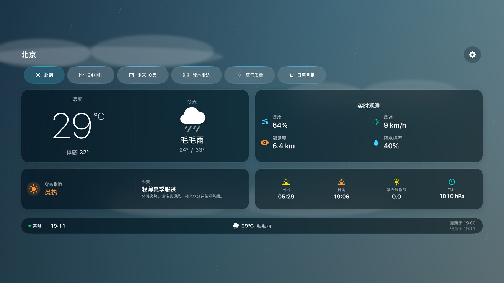

# RAYN Weather for Apple TV

[English](README.md) | 简体中文

**Weather, alive.**

> **项目状态：公开开源预览版。** 已提供可构建源码、测试、真机验证和自行安装说明；目前没有 App Store 或 TestFlight 分发。

RAYN Weather 是面向 tvOS 27 的原生 Apple TV 天气演播室。界面、动画和数据层彼此分离，方便公开协作，也方便后续替换天气或雷达服务。

## 实机界面预览



更多真实运行截图与 tvOS 27 演示视频见 [`docs/media/README.md`](docs/media/README.md)。项目定位、限制与完整介绍见 [`docs/PROJECT_OVERVIEW.md`](docs/PROJECT_OVERVIEW.md)，后续开发计划见 [`docs/ROADMAP.md`](docs/ROADMAP.md)。规划中的能力不会被写成已经完成的功能。

[观看 34 秒 tvOS 27 完整场景演示](docs/media/RAYN-tvOS27-demo.mp4)

## 设计边界

- 只展示真实网络数据；没有启动演示数据、假缓存或任何硬编码城市首屏。
- 首次启动优先读取 Apple TV 当前位置。定位失败时才尝试已经保存的地址，并明确显示定位状态。
- 天气动画由 `WeatherSnapshot.current` 的天气码、昼夜、能见度和降水量驱动。晴、云、雾、霾、雨、冻雨、雪、冰雹、雷暴使用不同的颜色和粒子层。
- 未来 10 天使用单一玻璃列表；每一天都能获得焦点，上下移动后按确认键会进入对应日期的详细天气页，返回后恢复原日期焦点。
- 数据服务异常时不伪造数值；海况或雷达没有覆盖时显示无覆盖状态。
- 自动轮播默认关闭，可在全屏设置的“演播轮播”中主动开启；主页不显示实现注释或轮播状态文字。

## 代码结构

```text
RAYN/
├── App/              启动、位置优先级、设置状态
├── Models/           WeatherSnapshot 及跨数据源的统一模型
├── Services/         Provider 协议、可注入 HTTP、独立供应商适配器与刷新编排
├── Features/         演播场景和设置界面
├── VisualEffects/    天气情境到动画层的映射
└── Shared/            大屏布局、玻璃卡片、焦点样式
```

数据流固定为：

```text
ForecastProvider / AirQualityProvider / RadarProvider / MarineWeatherProvider
                                  ↓
                       WeatherProviderSuite
                                  ↓
                         RefreshCoordinator
                                  ↓
                           WeatherSnapshot
                                  ↓
                    场景、动画、遥控器焦点和详情
```

`WeatherSnapshot` 是 UI 与外部服务之间的边界。新增服务时优先实现对应 Provider 和转换器，不要把 JSON 字段或服务 URL直接写进 View。

## 更换天气或雷达服务

服务选择集中在：

`RAYN/Services/ProviderConfiguration.swift`

默认配置集中在同一个组合根：

```swift
static let forecastSource: ForecastSource = .openMeteo
static let airQualitySource: AirQualitySource = .openMeteo
static let radarSource: RadarSource = .rainViewer
static let marineSource: MarineSource = .openMeteo
static let locationSearchSource: LocationSearchSource = .openMeteo
```

每类服务都拥有独立协议、实现文件和工厂。只替换一个来源时，新增对应 Provider 并扩展该枚举；需要由宿主应用动态组合时，直接向 `RefreshCoordinator(providers:)` 注入 `WeatherProviderSuite`，地址搜索则从 `AppState` 初始化器注入。网络型 Provider 还可注入 `HTTPClient`，因此慢网、超时和状态码测试不依赖真实服务器。两种替换方式都不需要改 View。

启用 WeatherKit 时，将 `forecastSource` 改成 `.weatherKit`，然后在自己的 Apple Developer App ID 中开启 WeatherKit capability，并使用自己的签名配置构建。私钥、Service ID、JWT 或账号信息不能进入仓库。适配代码在 `WeatherKitForecastProvider.swift`，其余业务代码不依赖 WeatherKit 类型。

## 安装到 Apple TV

自行安装不要求付费 Apple Developer Program 会员。使用免费 Apple 账号登录 Xcode、选择 Personal Team 后即可签名并安装到自己的 Apple TV；免费描述文件有效期为 7 天，到期需要重新构建安装。完整步骤与限制见 [`docs/INSTALLATION.md`](docs/INSTALLATION.md)。

## 本地构建与测试

使用 Xcode 27 beta、Apple TV SDK 27：

```bash
DEVELOPER_DIR=/Applications/Xcode-beta.app/Contents/Developer \
xcodebuild -project RAYN.xcodeproj -scheme RAYN \
-destination 'platform=tvOS Simulator,name=Apple TV 4K (3rd generation)' test
```

网络 Provider 测试使用注入的假失败 Provider，只验证错误处理，不把假天气当成产品数据。

关键 tvOS 焦点路径由 `RAYNUITests` 使用 `XCUIRemote` 验证，包括 24 小时 → 10 天 → 雷达、10 天日期选择与详情返回、设置按钮与全屏设置页。模拟器测试通过后，仍须在 Apple TV 4K（第二代，A12）验证真实地图和 4K 转场。

## 开源维护约定

1. Provider 只负责请求和转换，不能负责界面布局。
2. 所有外部数据都要记录更新时间、覆盖限制和归因要求。
3. 天气码映射必须有测试；遇到新天气码应显式扩展映射，不要默认成晴天。
4. 不提交 API key、WeatherKit 私钥、用户位置历史或个人开发者配置。
5. 修改大屏布局后，要在 tvOS 27 Simulator 和实体 Apple TV 上检查焦点路径、远距离可读性和减少动态效果选项。
6. 不以截图或静态 JSON 代替实时数据；需要 UI 预览时使用测试夹具，并确保它不进入正式启动路径。
7. Xcode 工程不保存个人 Development Team；真机构建时由维护者在本机选择团队或通过构建参数传入。

数据服务、许可证和雷达归因边界见 [`docs/DATA_SOURCES.md`](docs/DATA_SOURCES.md)。

代码分层、真实数据不变量、tvOS 焦点规则和 AI 接手协议见 [`docs/ARCHITECTURE.md`](docs/ARCHITECTURE.md)。

A12 设备的雷达切换根因、已完成优化、真机验收标准和后续重构优先级见 [`docs/CODE_REVIEW.md`](docs/CODE_REVIEW.md)。

## 作者与许可证

RAYN Weather 由 **QHWORK** 创建并维护，欢迎通过 Issue 和 Pull Request 参与贡献。

项目源代码与原创资源采用 [MIT License](LICENSE) 开放。天气数据、雷达瓦片、Apple 平台框架与相关商标不属于 MIT 授权范围，分别受其提供方条款约束。详见 [`NOTICE.md`](NOTICE.md)。
