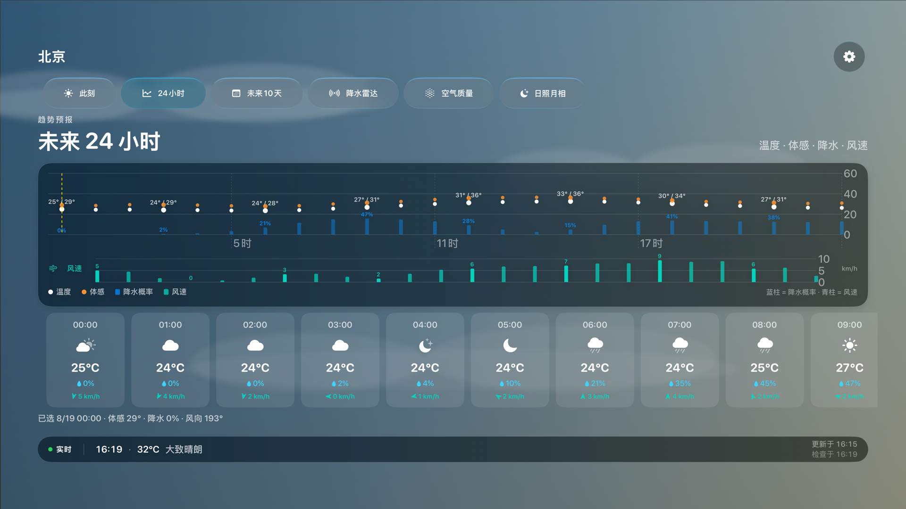
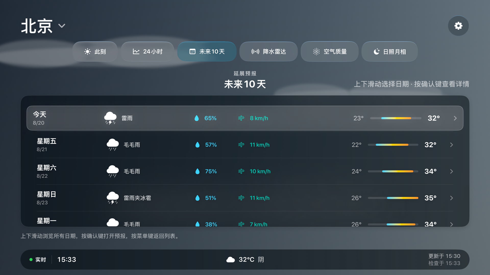
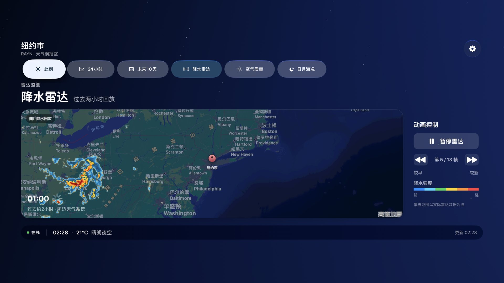
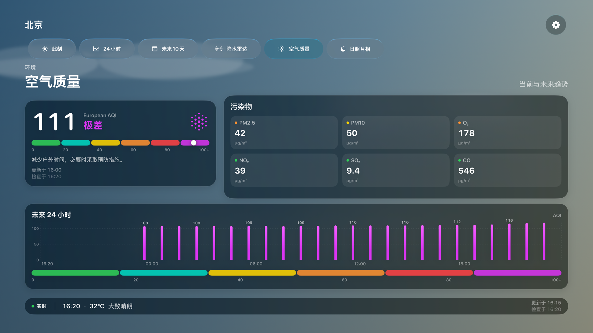
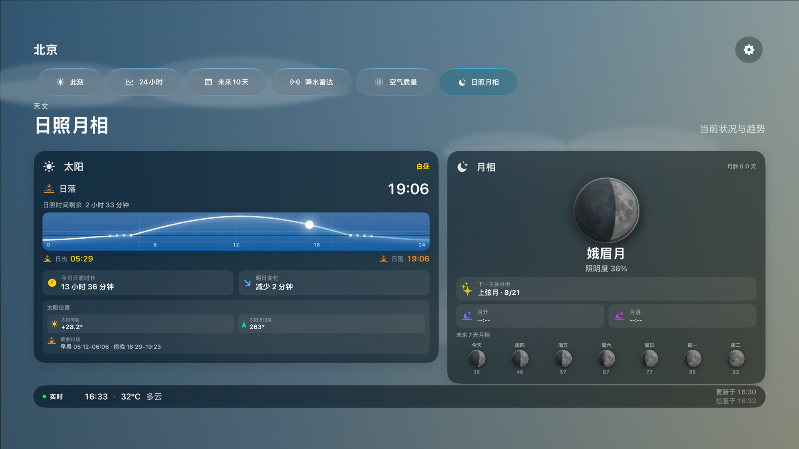
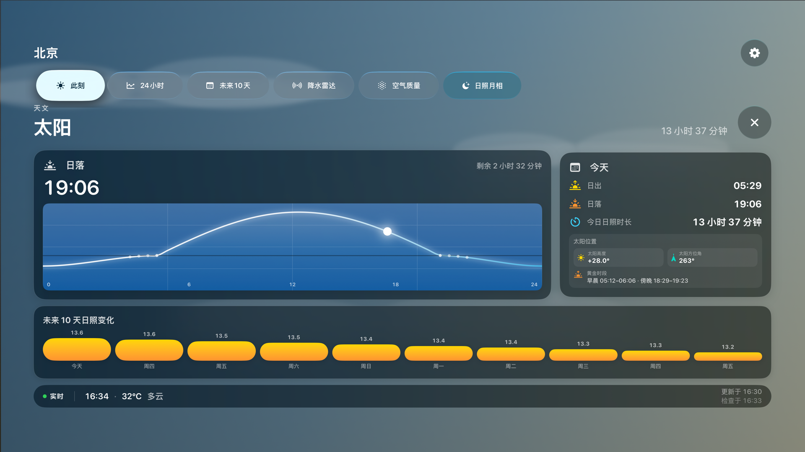
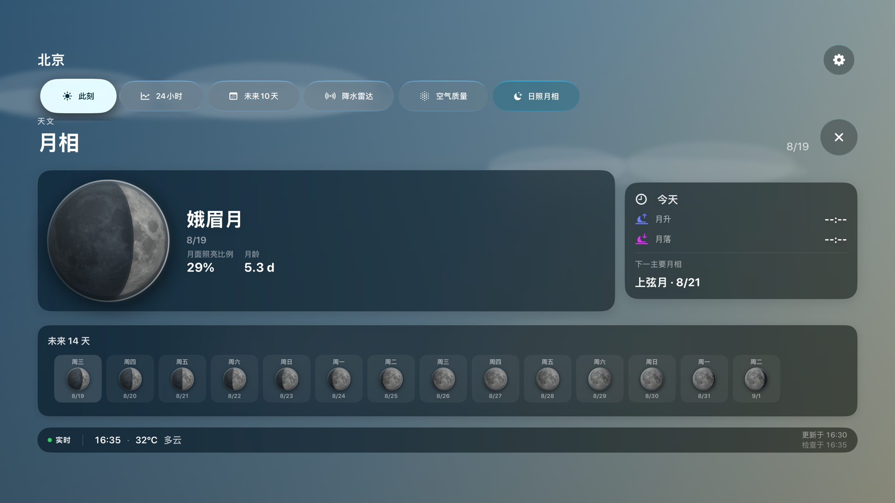

# RAYN Weather Media

Every item in this directory is a capture of a real RAYN Weather Debug build using live provider responses. These are product captures, not concept art or substituted weather mockups.

Repository media uses only public city coordinates. Beijing is used for the general scene gallery, and New York City is used for radar and the walkthrough. No personal location is included. Live values can differ when the providers are queried again.

## Walkthrough

[Watch the 34-second tvOS 27 walkthrough](RAYN-tvOS27-demo.mp4)

The walkthrough was recorded from the tvOS 27 simulator at 1920 × 1080. The radar scene uses the same live RainViewer tile renderer as hardware. The separate radar screenshot below was captured on an Apple TV 4K (2nd generation, A12) to confirm the hardware path.

## Screenshots

| Current conditions | 24-hour forecast |
| --- | --- |
|  |  |

| 10-day forecast | Live radar on A12 Apple TV |
| --- | --- |
|  |  |

| Air quality | Sun, moon, and conditional marine detail |
| --- | --- |
|  |  |

| Solar path detail | Lunar phase detail |
| --- | --- |
|  |  |

The Debug-only `RAYN_CAPTURE_LOCATION` hook accepts `beijing`, `shanghai`, `new-york`, `shenzhen`, `london`, or `vancouver`. It changes coordinates for reproducible capture but continues to request live weather. Release builds ignore the hook, and normal startup remains current-location first.

The Debug-only `RAYN_ASTRONOMY_DETAIL` value can be `sun` or `moon` when maintainers need deterministic detail-view screenshots. It changes only the initially visible panel and never changes weather values or release behavior.

For simulator video capture, `RAYN_SIMULATOR_RADAR=1` opts the Debug build into the same live radar tile renderer used on Apple TV hardware. The simulator continues to show its deterministic unavailable state by default.

Files may be reused when describing or reviewing RAYN Weather, provided the project is identified accurately. Apple, tvOS, and third-party service trademarks remain the property of their owners.
